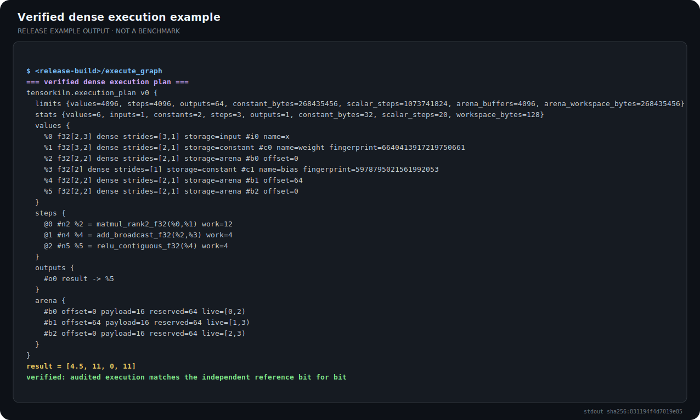
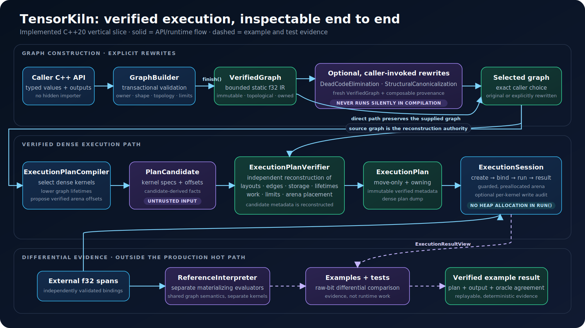
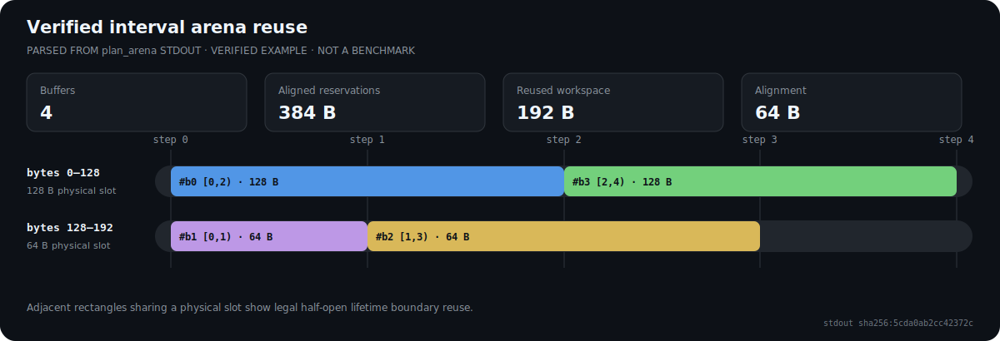
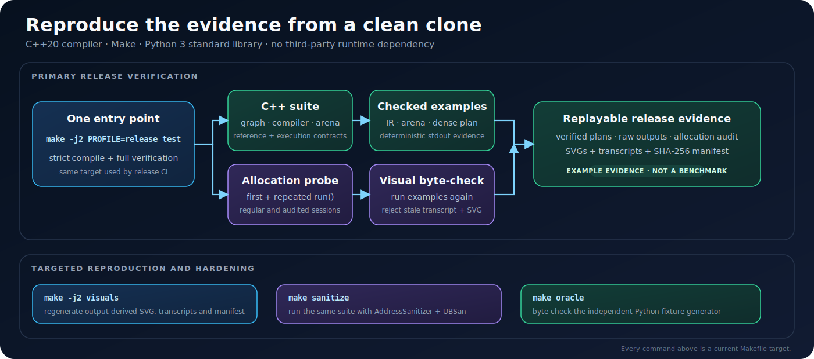

# TensorKiln

[![CI][ci-badge]][ci-workflow]

TensorKiln is a dependency-free C++20 project building a bounded static `f32`
tensor compiler/runtime. It verifies and reference-executes graphs, applies
explicit deterministic rewrites, compiles a selected graph into an
independently verified dense execution plan, and runs that plan in a guarded,
preallocated arena.

The project keeps one deliberately narrow compiler/runtime architecture small
enough to inspect end to end. Its v0.1.0 target covers type and shape
verification, deterministic graph rewrites, layout lowering, kernel selection,
lifetime-based memory reuse, and differential validation against a separate
reference interpreter.

> **Status:** the current vertical slice includes the bounded graph front-end,
> independent Python and C++ reference paths, explicit dead-code elimination
> and structural canonicalization, reverse-verified arena planning, five dense
> row-major kernels, and a synchronous allocation-free session run path.
> Fusion, views and in-place aliases, scratch, prepacking, broader operators,
> SIMD, threading, cache-aware kernels, and benchmarks remain outside the
> implemented boundary. The non-prerelease v0.1.0 contract below is the target;
> **Available now** is the exact current subset.

## See the current slice execute

[](docs/visuals/generated/execute-graph.svg)

The panel above is the complete stdout of the checked release example, not a
mockup or benchmark. It shows the selected `MatMul -> Add -> Relu` kernels,
their arena placements, the result `[4.5, 11, 0, 11]`, and the final raw-bit
comparison with the separately implemented reference interpreter. The
[plain-text transcript](docs/visuals/generated/execute-graph.txt) and
[SHA-256 evidence manifest](docs/visuals/generated/manifest.json) are committed
beside the image.

Rebuild and byte-check every generated visual with the standard-library-only
renderer:

```bash
make -j2 visuals
make visuals-check
```

## Why this exists

Tensor runtimes often hide graph semantics, allocation policy, and numerical
trade-offs behind a large dependency stack. TensorKiln keeps one useful slice
small enough to audit end to end:

[](docs/visuals/architecture.svg)

*Architecture of the implemented vertical slice. Solid arrows are API and
runtime flow; dashed arrows are evidence produced by examples and tests, not
work performed inside `ExecutionSession::run()`. Open the image for the
full-size labels.*

These remain explicit API calls: plan compilation operates on whichever
verified graph the caller supplies and never silently runs graph rewrites. The
goal is evidence, not a production-runtime claim. Examples and differential
tests check executed results against a separately implemented interpreter under
a documented numerical policy, and every executable plan is reconstructed by a
verifier that does not trust compiler-derived operands, layouts, lifetimes,
accounting, or storage.

## Target v0.1.0 contract

- C++20 and the standard library only.
- Immutable, topologically ordered SSA graphs with static shapes.
- `f32`, rank 0 through 4, positive extents, checked element and byte counts.
- Transformer-oriented operations: `MatMul`, `Add`, `Mul`, `Relu`, `Gelu`,
  `Softmax`, `LayerNorm`, `Reshape`, and `Transpose`.
- A logical graph IR separated from the strided, allocation-aware execution
  plan.
- A reference interpreter that does not reuse optimized kernels.
- Deterministic IR and plan dumps suitable for regression tests.
- GCC, Clang, AddressSanitizer, and UndefinedBehaviorSanitizer coverage.

The semantics borrow only the relevant, explicitly documented pieces of the
[ONNX IR](https://onnx.ai/onnx/repo-docs/IR.html) and
[broadcasting](https://onnx.ai/onnx/repo-docs/Broadcasting.html) contracts.
TensorKiln is not an ONNX importer and does not claim ONNX conformance.

## Available now

The current vertical slice is small but runnable and inspectable:

- checked scalar and rank 1-4 tensor types with explicit element/byte ceilings;
- trailing multidirectional broadcasting and rank 2-4 batched `MatMul`
  inference;
- a transactional `GraphBuilder` for `Input`, `Constant`, `Add`, `MatMul`, and
  `Relu`;
- owner-tagged handles that reject accidental cross-graph use;
- immutable verified graphs with deterministic, golden-tested IR dumps;
- graph-wide node, output, name, tensor, and cumulative constant-data limits;
- an isolated contiguous reference interpreter with owner-safe result lookup,
  exact payload/work ceilings, and fail-closed floating-point environment
  checks;
- bit-exact Python-stdlib fixtures consumed at real `MatMul -> Add -> Relu`
  boundaries;
- deterministic dead-code elimination that preserves the complete input
  contract, output declaration order and aliases, exact source construction
  limits, and bitwise constant payloads;
- deterministic structural canonicalization with exact CSE for `Add`, `MatMul`,
  and `Relu`, plus the semantics-preserving `Relu(Relu(x)) -> Relu(x)` rule;
- an output-alias guard that prevents equivalent source outputs from silently
  collapsing into one result value;
- owner-safe, composable provenance with stable pass statistics and
  deterministic dumps, including many-source-to-one-result lineage;
- a deterministic best-fit arena planner with 64-byte-aligned offsets for
  explicit storage-root sizes and half-open lifetimes, with coalescing and
  boundary reuse;
- an independent placement verifier with checked arithmetic, exact workspace
  accounting, canonical dumps, stable diagnostics, and seeded pairwise-oracle
  coverage;
- a graph-to-arena storage projection that gives every `Add`, `MatMul`, and
  `Relu` result a dense sequential step and buffer ordinal, leaves inputs and
  constants external, retains dead compute, and keeps arena-backed outputs live
  through the final compute step;
- mandatory reverse reconstruction of graph mappings, lifetimes, limits,
  statistics, and allocations before a planned graph projection is returned,
  with seeded DAG, heterogeneous `MatMul`, ownership, fault-injection, and exact
  4096/4097-buffer boundary evidence;
- a move-only `ExecutionPlan` that owns its selected graph, dense row-major
  layouts, external-input and owned-constant storage, arena-backed results,
  deterministic dump, exact limits, and checked work accounting;
- independently verified selection of `Add` contiguous/broadcast, rank-2 and
  batched `MatMul`, and contiguous `Relu` kernels;
- an `ExecutionSession` with a 64-byte-aligned workspace, outer guards for
  every non-empty workspace, explicit input binding, stale-safe result lookup,
  and an optional per-kernel shadow audit that rejects writes outside the exact
  output payload;
- fail-closed checks for nearest binary32 rounding, binary64 intermediate
  precision, and gradual `f32` underflow without changing the caller's
  floating-point modes;
- a release-profile allocation probe that wraps C and C++ allocation entry
  points and covers the first and repeated `run()` for all five kernels,
  regular and audited sessions, result lookup, and a zero-work external plan;
- a replayable seeded differential corpus of 128 dense DAGs, with arena reuse
  and raw-bit comparison against the independent reference interpreter.

Validation failures never consume an ID, reserve a name, or mutate resource
counters. Constants own their exact IEEE-754 payload; the canonical dump uses a
stable bitwise fingerprint and does not depend on locale or pointer values.

[](docs/visuals/generated/arena-reuse.svg)

*The real `plan_arena` example places 384 bytes of aligned reservations in a
192-byte workspace. Adjacent bars reuse a physical slot only where half-open
lifetimes meet at an exact boundary. This is allocator evidence, not a
performance measurement; the
[source transcript](docs/visuals/generated/arena-plan.txt) is available for
inspection.*

[](docs/visuals/reproduce.svg)

*The primary release target compiles and checks the current slice, exercises
all three evidence-producing examples, probes allocation-free execution, and
rejects stale generated visuals. Sanitizer and independent-fixture checks stay
explicit so each failure has a narrow meaning.*

```bash
make -j2 PROFILE=debug test
make -j2 PROFILE=release test
make sanitize
make oracle
make visuals-check
```

TensorKiln v0.1.0-alpha.1 is a source-only milestone with an experimental 0.x
API. It is tested on Ubuntu 24.04 with GCC 14 and Clang 18; no
installable package or binary distribution is provided. Version tags are the
authoritative version source, and no compatibility boundary is promised before
v1.0.0. See the
[alpha release notes](docs/releases/v0.1.0-alpha.1.md) and
[changelog](CHANGELOG.md) for the shipped boundary and known limitations.

The debug and release commands run the strict dependency-free suite and all
three checked examples. Release additionally runs the allocation probe and
rejects stale generated visuals. The examples inspect the graph-rewrite
pipeline, show verified interval reuse, and execute an audited
`MatMul -> Add -> Relu` plan while requiring raw-bit agreement with the
independent interpreter. The sanitizer target runs the same suite under
AddressSanitizer and UndefinedBehaviorSanitizer; the oracle target proves that
the committed golden fixture still matches its independent generator. See
[the graph IR contract](docs/ir.md) for construction invariants and
[the reference interpreter contract](docs/reference.md) for execution,
resource, lifetime, and numerical semantics. See
[the compiler-pass contract](docs/compiler.md) for dead-code roots, semantic
equivalence, exact canonicalization rules, output alias classes, provenance
composition, and determinism. The verified storage-planning boundary is
specified in [the arena contract](docs/arena.md); executable plan, session,
binding, view, memory-integrity, and allocation contracts live in
[the execution contract](docs/execution.md).

## Proof obligations

The non-prerelease v0.1.0 milestone is complete only when the repository
demonstrates all of the following:

1. malformed graphs fail before execution with stable, typed diagnostics;
2. optimized and reference execution agree on golden, randomized, and
   transformer-block workloads;
3. compiler passes preserve provenance and produce deterministic output;
4. the arena verifier rejects overlapping live allocations and invalid aliases;
5. a reusable execution session performs no heap allocation inside `run()`;
6. benchmarks report reproducible measurements, checksums, compiler flags, and
   workspace bytes without hard-coded performance claims.

The exact scope, invariants, and exclusions live in
[the v0.1 charter](docs/charter.md). Numerical comparisons are governed by
[the numerical policy](docs/numerics.md).

## Non-goals

TensorKiln v0.1 will not implement dynamic shapes, zero-sized tensors,
autograd, training, quantization, convolution, a general ONNX frontend, JIT
code generation, GPU execution, distributed execution, or a production BLAS
replacement. It intentionally uses no Eigen, BLAS, oneDNN, LLVM, or MLIR
runtime dependency.

## License

[MIT](LICENSE)

[ci-badge]: https://github.com/omar07ibrahim/tensorkiln/actions/workflows/ci.yml/badge.svg
[ci-workflow]: https://github.com/omar07ibrahim/tensorkiln/actions/workflows/ci.yml
