# TensorKiln

[![CI][ci-badge]][ci-workflow]

TensorKiln is a dependency-free C++20 project building a bounded static `f32`
tensor compiler/runtime. It verifies and reference-executes graphs, applies
explicit deterministic rewrites, compiles a selected graph into an
independently verified dense execution plan, and runs that plan in a guarded,
preallocated arena.

The project keeps one deliberately narrow compiler/runtime architecture small
enough to inspect end to end. Its v0.1.0 target covers type and shape
verification, deterministic graph rewrites, layout lowering, kernel selection,
lifetime-based memory reuse, and differential validation against a separate
reference interpreter.

> **Status:** the current vertical slice includes the bounded graph front-end,
> independent Python and C++ reference paths, explicit dead-code elimination
> and structural canonicalization, reverse-verified arena planning, eight
> `DenseKernelKind` values (seven algebraic plus last-axis `Softmax`), and a
> synchronous allocation-free session run path. The two `Mul` kinds were
> appended at stable public ordinals 6 and 7.
> A bounded command-line registry exposes exactly two compiled-in workloads,
> `dense_relu_v1` and `reglu_mlp_v1`, through the same public APIs. It emits
> deterministic plan inspection and executes exact raw-bit inputs only with
> kernel-write auditing and independent-reference agreement.
> Axis-aware `Softmax` is available throughout the graph and reference layers;
> the optimized plan supports only its canonical last axis, while other valid
> axes remain reference-only.
> Fusion, views and in-place aliases, scratch, prepacking, broader operators,
> SIMD, threading, cache-aware kernels, and benchmarks remain outside the
> implemented boundary. The non-prerelease v0.1.0 contract below is the target;
> **Available now** is the exact current subset.

[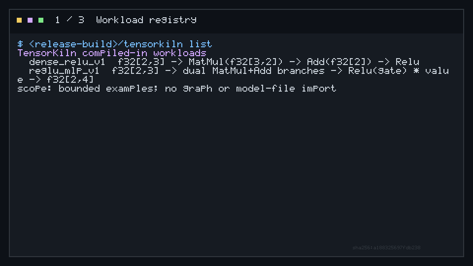](docs/visuals/generated/reglu-demo.gif)

*This three-frame hero is rendered from byte-replayed output of the real
release CLI, not from a mock terminal. Presentation delays are not timing
measurements. Open the [static terminal capture](docs/visuals/generated/reglu-terminal.png),
read the [complete command transcript](docs/visuals/generated/reglu-demo-transcript.txt),
or inspect the [v4 SHA-256 evidence manifest](docs/visuals/generated/manifest.json).*

## Run the captured workflow

Build the dependency-free release CLI, then reproduce the three real text
captures used by the hero:

```bash
make -j2 PROFILE=release cli
build/g++/release/tensorkiln list
build/g++/release/tensorkiln inspect --workload reglu_mlp_v1
build/g++/release/tensorkiln execute \
  --workload reglu_mlp_v1 \
  --input-bits x=0x3f800000,0x40000000,0x40400000,0xbf800000,0x3f000000,0x40800000
```

The commands require only a C++20 compiler, GNU Make, and the standard library.
They print no timing measurements and perform no network access.

## Inspect the ReGLU vertical slice

`reglu_mlp_v1` accepts one `x: f32[2,3]` input and builds two
`MatMul -> Add` branches, applies `Relu` to the gate branch, and multiplies the
gate and value tensors. The verified plan contains exactly six steps using four
distinct kernel kinds: `matmul_rank2_f32`, `add_broadcast_f32`,
`relu_contiguous_f32`, and `mul_contiguous_f32`.

[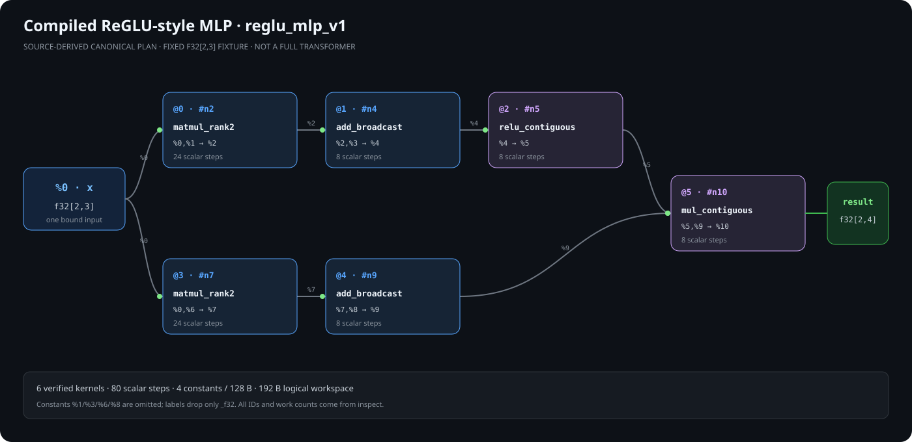](docs/visuals/generated/reglu-graph.svg)

*The graph is derived from the complete replayed
[`inspect` JSON](docs/visuals/generated/reglu-inspect.json) and its
[plain-text plan dump](docs/visuals/generated/reglu-inspect.txt). Repeated
kernel uses remain six separate audited steps; “four kinds” does not mean four
steps or a fused kernel.*

[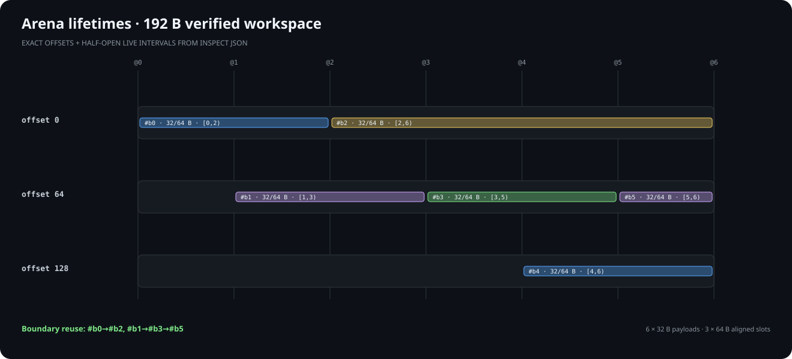](docs/visuals/generated/reglu-arena.svg)

*The arena view shows all six plan buffers, their half-open lifetimes, and the
verified reuse that fits six 64-byte reservations into a 192-byte workspace.
It is storage-planning evidence, not a memory-throughput measurement.*

Execution publishes one output tensor, `result: f32[2,4]`, containing eight raw
`f32` words only after all 8/8 match the independent interpreter.

[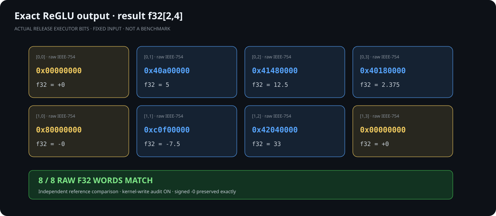](docs/visuals/generated/reglu-output.svg)

*The exact words come from the replayed
[`execute` JSON](docs/visuals/generated/reglu-execute.json) and
[text output](docs/visuals/generated/reglu-execute.txt). This fixture
demonstrates the selected contiguous `Mul` path only; broadcasting `Mul` is
implemented and tested elsewhere, but is not exercised by this
`reglu_mlp_v1` fixture. No timing or full-transformer claim is attached to it.*

## Preserved dense and Softmax evidence

[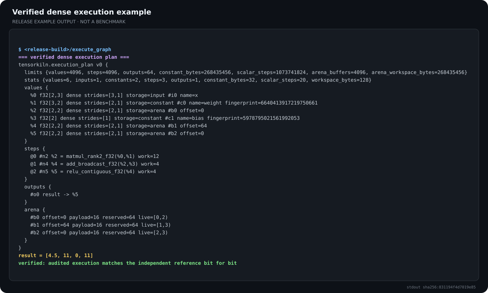](docs/visuals/generated/execute-graph.svg)

This dense panel is preserved from the published v3 evidence set and remains
bound by the current v4 manifest. It is the complete stdout of the checked
release example, not a mockup or benchmark. It shows the selected
`MatMul -> Add -> Relu` kernels, their arena placements, the result
`[4.5, 11, 0, 11]`, and the final raw-bit comparison with the separately
implemented reference interpreter. The
[plain-text transcript](docs/visuals/generated/execute-graph.txt) and
[SHA-256 evidence manifest](docs/visuals/generated/manifest.json) are committed
beside the image.

The separate
[`execute_softmax`](examples/execute_softmax.cpp) example exercises a verified
last-axis `softmax_last_axis_f32` plan in audited mode. It prints the raw output
bits for five deliberately exact policy slices, requires all 20 bits to agree
with both the independent interpreter and an explicit fixture, then
reference-executes a valid axis-zero graph and shows its typed rejection by the
optimized planner.

[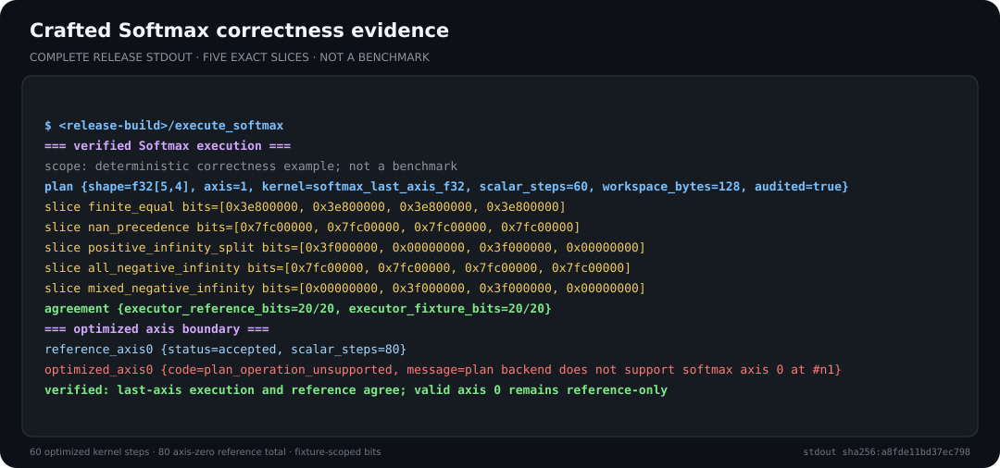](docs/visuals/generated/execute-softmax.svg)

This is the complete stdout of the real release executable. The
[plain-text Softmax transcript](docs/visuals/generated/execute-softmax.txt)
shows 60 optimized kernel steps, 80 total reference steps for the axis-zero
case, both 20/20 bit-agreement checks, and the typed reference-only boundary.
This narrow fixture covers equal finite inputs and the documented NaN/infinity
branches; it does not claim that arbitrary finite `std::exp` results are
bit-identical across math libraries, and it is not a benchmark. The
[evidence manifest](docs/visuals/generated/manifest.json) binds the complete
transcript and image to SHA-256 hashes of the captured executable and to the
commit, tree, and Git blob IDs of every declared build input.

Rebuild and byte-check every generated visual with the standard-library-only
renderer:

```bash
make -j2 visuals
make visuals-check
```

## Inspect machine-readable contracts

The same exact two-entry catalog and ReGLU fixture are available as versioned
JSON for scripts and regression review:

```bash
make -j2 PROFILE=release cli
build/g++/release/tensorkiln list --format=json
build/g++/release/tensorkiln inspect \
  --workload reglu_mlp_v1 \
  --format=json
build/g++/release/tensorkiln execute \
  --workload reglu_mlp_v1 \
  --input-bits x=0x3f800000,0x40000000,0x40400000,0xbf800000,0x3f000000,0x40800000 \
  --format=json
```

The catalog contains exactly `dense_relu_v1` and `reglu_mlp_v1`; it is not
open-ended discovery. Its byte-replayed release output is committed as both
[registry JSON](docs/visuals/generated/cli-workloads.json) and
[plain text](docs/visuals/generated/reglu-list.txt). Both ReGLU reports come
from a real `GraphBuilder -> ExecutionPlanCompiler` path.
Inspection includes the exact input/output contract, plan statistics, selected
kernels, and canonical verified-plan dump. Execution additionally enables the
per-kernel write-set audit, runs the session, and publishes output only after
all eight raw `f32` words in its one output tensor match the separate
`ReferenceInterpreter`.

### Preserved v3 dense workload evidence

[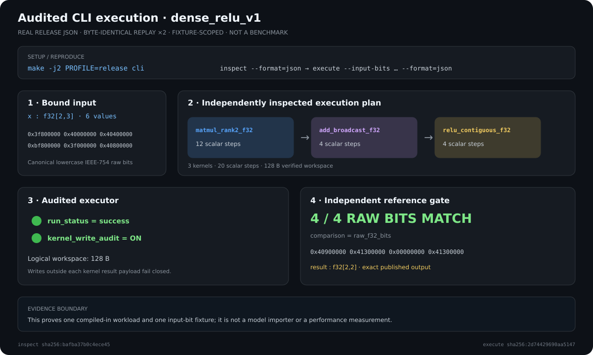](docs/visuals/generated/cli-execution.svg)

*The v4 bundle deliberately carries this v3 `dense_relu_v1` panel and its
source artifacts forward with their published digests. It is derived from the
real [`inspect` JSON](docs/visuals/generated/cli-inspect.json) and
[`execute` JSON](docs/visuals/generated/cli-execute.json). The release binary
ran each command twice with byte-identical stdout before the evidence manifest
recorded the ELF, source, generator, command, and artifact hashes. The claim is
limited to `dense_relu_v1` and these six input values; there are no timing
fields and this is not a benchmark.*

The workload catalog is intentionally compiled in: this is not a graph-dump
parser, general model runner, or model-file importer. The complete command,
schema, failure, resource, and evidence contracts are documented in
[the CLI contract](docs/cli.md).

## Why this exists

Tensor runtimes often hide graph semantics, allocation policy, and numerical
trade-offs behind a large dependency stack. TensorKiln keeps one useful slice
small enough to audit end to end:

[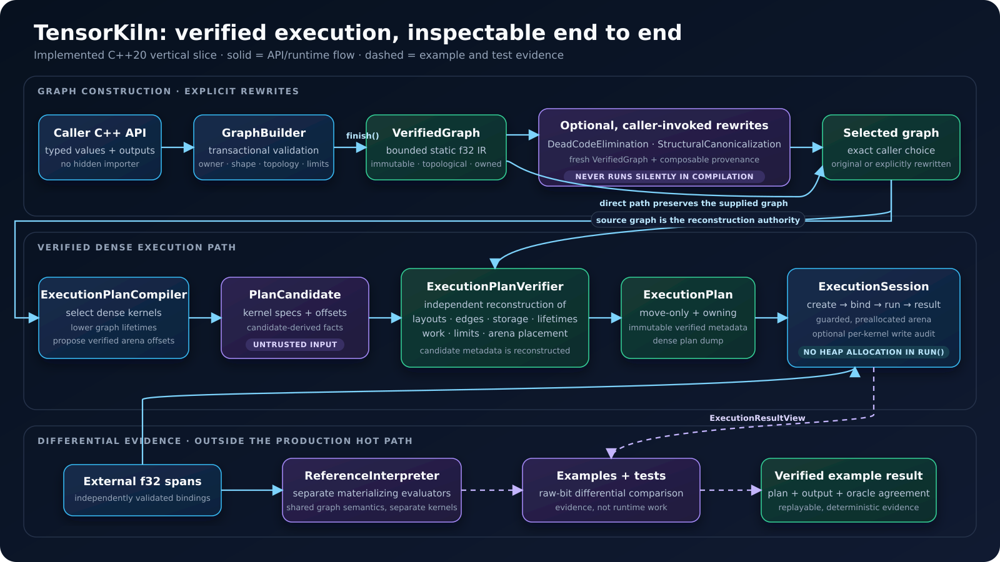](docs/visuals/architecture.svg)

*Architecture of the implemented vertical slice. Solid arrows are API and
runtime flow; dashed arrows are evidence produced by examples and tests, not
work performed inside `ExecutionSession::run()`. Open the image for the
full-size labels.*

These remain explicit API calls: plan compilation operates on whichever
verified graph the caller supplies and never silently runs graph rewrites. The
goal is evidence, not a production-runtime claim. Examples and differential
tests check executed results against a separately implemented interpreter under
a documented numerical policy, and every executable plan is reconstructed by a
verifier that does not trust compiler-derived operands, layouts, lifetimes,
accounting, or storage.

## Target v0.1.0 contract

- C++20 and the standard library only.
- Immutable, topologically ordered SSA graphs with static shapes.
- `f32`, rank 0 through 4, positive extents, checked element and byte counts.
- Transformer-oriented operations: `MatMul`, `Add`, `Mul`, `Relu`, `Gelu`,
  `Softmax`, `LayerNorm`, `Reshape`, and `Transpose`.
- A logical graph IR separated from the strided, allocation-aware execution
  plan.
- A reference interpreter that does not reuse optimized kernels.
- Deterministic IR and plan dumps suitable for regression tests.
- GCC, Clang, AddressSanitizer, and UndefinedBehaviorSanitizer coverage.

The semantics borrow only the relevant, explicitly documented pieces of the
[ONNX IR](https://onnx.ai/onnx/repo-docs/IR.html) and
[broadcasting](https://onnx.ai/onnx/repo-docs/Broadcasting.html) contracts.
TensorKiln is not an ONNX importer and does not claim ONNX conformance.

## Available now

The current vertical slice is small but runnable and inspectable:

- checked scalar and rank 1-4 tensor types with explicit element/byte ceilings;
- a bounded `tensorkiln` inspect/execute CLI with stable text/JSON output,
  exact raw-bit inputs, mandatory write auditing and independent-reference
  agreement, exactly the `dense_relu_v1` and `reglu_mlp_v1` compiled-in
  workloads, typed errors, fixed exit codes, argument ceilings, and
  process-level replay tests;
- trailing multidirectional broadcasting and rank 2-4 batched `MatMul`
  inference;
- a transactional `GraphBuilder` for `Input`, `Constant`, `Add`, `Mul`,
  `MatMul`, `Relu`, and axis-aware `Softmax`, including canonical negative
  axes;
- owner-tagged handles that reject accidental cross-graph use;
- immutable verified graphs with deterministic, golden-tested IR dumps;
- graph-wide node, output, name, tensor, and cumulative constant-data limits;
- an isolated contiguous reference interpreter with owner-safe result lookup,
  exact payload/work ceilings, and fail-closed floating-point environment
  checks;
- subtract-maximum reference `Softmax` on every valid rank 1-4 axis, with
  fixed traversal, explicit NaN/infinity semantics, and a separate
  high-precision Python `Decimal` tolerance fixture;
- bit-exact Python-stdlib fixtures consumed at real `MatMul -> Add -> Relu`
  boundaries;
- deterministic dead-code elimination that preserves the complete input
  contract, output declaration order and aliases, exact source construction
  limits, and bitwise constant payloads;
- deterministic structural canonicalization with exact CSE for `Add`, `Mul`,
  `MatMul`, `Relu`, and canonical-axis `Softmax`, plus the semantics-preserving
  `Relu(Relu(x)) -> Relu(x)` rule;
- an output-alias guard that prevents equivalent source outputs from silently
  collapsing into one result value;
- owner-safe, composable provenance with stable pass statistics and
  deterministic dumps, including many-source-to-one-result lineage;
- a deterministic best-fit arena planner with 64-byte-aligned offsets for
  explicit storage-root sizes and half-open lifetimes, with coalescing and
  boundary reuse;
- an independent placement verifier with checked arithmetic, exact workspace
  accounting, canonical dumps, stable diagnostics, and seeded pairwise-oracle
  coverage;
- a graph-to-arena storage projection that gives every `Add`, `Mul`, `MatMul`,
  `Relu`, and `Softmax` result a dense sequential step and buffer ordinal,
  leaves inputs and constants external, retains dead compute, and keeps
  arena-backed outputs live through the final compute step;
- mandatory reverse reconstruction of graph mappings, lifetimes, limits,
  statistics, and allocations before a planned graph projection is returned,
  with seeded DAG, heterogeneous `MatMul`, ownership, fault-injection, and exact
  4096/4097-buffer boundary evidence;
- a move-only `ExecutionPlan` that owns its selected graph, dense row-major
  layouts, external-input and owned-constant storage, arena-backed results,
  deterministic dump, exact limits, and checked work accounting;
- independently verified selection of `Add` and `Mul` contiguous/broadcast,
  rank-2 and batched `MatMul`, contiguous `Relu`, and last-axis
  `softmax_last_axis_f32` kernels: eight kinds total, with the seven algebraic
  kinds distinct from `Softmax` and the appended `Mul` kinds fixed at ordinals
  6 and 7;
- a typed `plan_operation_unsupported` boundary for graph operations, including
  valid non-last-axis `Softmax`, that have no optimized kernel;
- an `ExecutionSession` with a 64-byte-aligned workspace, outer guards for
  every non-empty workspace, explicit input binding, stale-safe result lookup,
  and an optional per-kernel shadow audit that rejects writes outside the exact
  output payload;
- fail-closed checks for nearest binary32 rounding, binary64 intermediate
  precision, and gradual `f32` underflow without changing the caller's
  floating-point modes;
- a release-profile allocation probe that wraps C and C++ allocation entry
  points and covers first and repeated `run()` calls for all seven algebraic
  kernels, warm first and repeated last-axis `Softmax`, regular and audited
  sessions, result lookup, and a zero-work external plan;
- a replayable seeded differential corpus of 128 dense DAGs covering all seven
  algebraic kernels, with arena reuse and raw-bit comparison against the
  independent reference interpreter, plus a separate seeded last-axis
  `Softmax` corpus using tolerance, normalization, and translation-invariance
  checks.

Validation failures never consume an ID, reserve a name, or mutate resource
counters. Constants own their exact IEEE-754 payload; the canonical dump uses a
stable bitwise fingerprint and does not depend on locale or pointer values.

[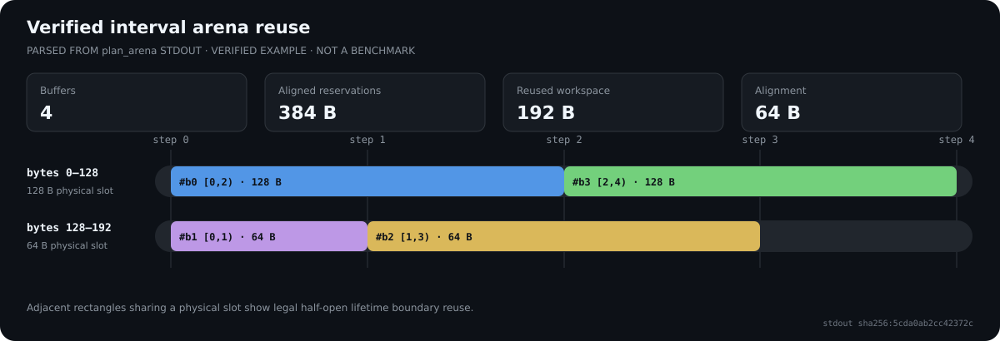](docs/visuals/generated/arena-reuse.svg)

*The real `plan_arena` example places 384 bytes of aligned reservations in a
192-byte workspace. Adjacent bars reuse a physical slot only where half-open
lifetimes meet at an exact boundary. This is allocator evidence, not a
performance measurement; the
[source transcript](docs/visuals/generated/arena-plan.txt) is available for
inspection.*

[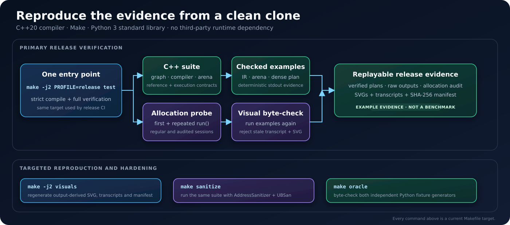](docs/visuals/reproduce.svg)

*The primary release target compiles and checks the current slice, exercises
every checked example, probes allocation-free execution, and
rejects stale generated visuals. Sanitizer and independent-fixture checks stay
explicit so each failure has a narrow meaning. The source-archive gate is a
separate committed-source check rather than another working-tree build.*

```bash
make -j2 PROFILE=debug test
make -j2 PROFILE=release test
make sanitize
make oracle
make visuals-check
make source-archive-check
```

`source-archive-check` requires its declared inputs to match committed `HEAD`,
validates a bounded `git archive` member-by-member against Git's tracked blob
IDs and modes, extracts it into a private temporary directory, builds the
release CLI there, and verifies the archived workload registry and audited
fixtures. Its canonical receipt identifies the commit, tree, archive, and CLI
outputs; the archive and build directory are not published artifacts.

## Published production-source coverage snapshot

[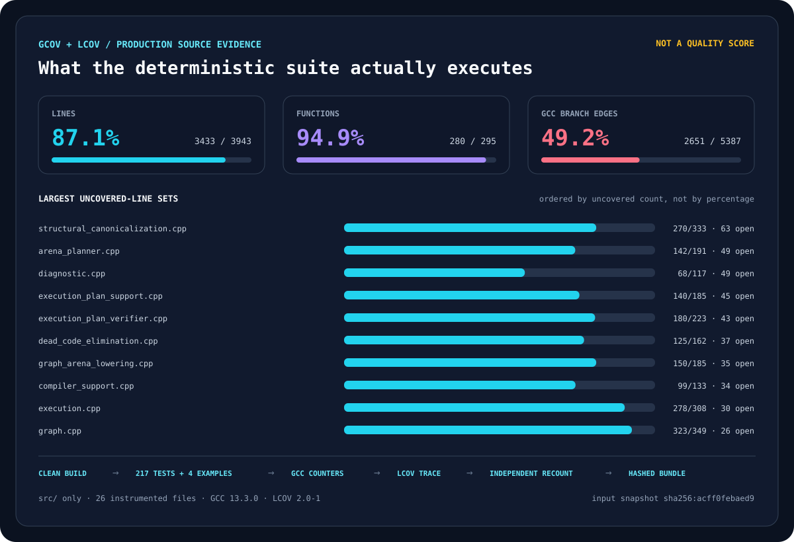](docs/coverage/generated/summary.svg)

The committed v1 coverage bundle is a published snapshot of one clean GCC
13.3/LCOV 2.0 capture, not a live badge for the Unreleased working tree. That
capture ran its recorded 247-test C++ binary, 14-check CLI integration suite,
and four checked examples before reporting only executable records under
`src/`: 4102/4694 lines (87.4%), 345/362 functions (95.3%), and
3171/6407 GCC branch edges (49.5%) across 27 instrumented production files.
The branch denominator includes compiler-generated control flow, including exception
paths; these measurements are not benchmarks, release gates, proxies for
semantic correctness, or a claim about code added after the snapshot.

The [coverage contract](docs/coverage/README.md) documents setup, exact scope,
the clean capture pipeline, independent trace validation, and interpretation
limits. The public bundle includes the
[text summary](docs/coverage/generated/summary.txt),
[normalized LCOV trace](docs/coverage/generated/coverage.info),
[complete test transcript](docs/coverage/generated/test-run.txt), and
[hash manifest](docs/coverage/generated/manifest.json). Rebuild or
byte-check it with LCOV 2.x installed:

```bash
make COVERAGE_JOBS=2 coverage
make COVERAGE_JOBS=2 coverage-check
```

TensorKiln v0.1.0-alpha.1 is a source-only milestone with an experimental 0.x
API. It is tested on Ubuntu 24.04 with GCC 14 and Clang 18; no
installable package or binary distribution is provided. Version tags are the
authoritative version source, and no compatibility boundary is promised before
v1.0.0. See the
[alpha release notes](docs/releases/v0.1.0-alpha.1.md) and
[changelog](CHANGELOG.md) for the shipped boundary and known limitations.

The debug and release commands run the strict dependency-free suite and every
checked example. Release additionally runs the allocation probe and rejects
stale generated visuals. The examples inspect the graph-rewrite pipeline, show
verified interval reuse, and execute an audited `MatMul -> Add -> Relu` plan
while requiring raw-bit agreement with the independent interpreter. The
bounded CLI exposes that preserved `dense_relu_v1` fixture and the six-step
`reglu_mlp_v1` contiguous-`Mul` fixture through replayed, versioned output. A
separate audited Softmax example exposes the last-axis kernel, exact non-finite
policy, independent-reference agreement, and the reference-only non-last-axis
boundary. The sanitizer target runs the same suite under AddressSanitizer and
UndefinedBehaviorSanitizer; the oracle target proves that both committed
numerical fixtures still match their independent generators. See
[the graph IR contract](docs/ir.md) for
construction invariants and
[the reference interpreter contract](docs/reference.md) for execution,
resource, lifetime, and numerical semantics. See
[the compiler-pass contract](docs/compiler.md) for dead-code roots, semantic
equivalence, exact canonicalization rules, output alias classes, provenance
composition, and determinism. The verified storage-planning boundary is
specified in [the arena contract](docs/arena.md); executable plan, session,
binding, view, memory-integrity, and allocation contracts live in
[the execution contract](docs/execution.md).

## Proof obligations

The non-prerelease v0.1.0 milestone is complete only when the repository
demonstrates all of the following:

1. malformed graphs fail before execution with stable, typed diagnostics;
2. optimized and reference execution agree on golden, randomized, and
   transformer-block workloads;
3. compiler passes preserve provenance and produce deterministic output;
4. the arena verifier rejects overlapping live allocations and invalid aliases;
5. a reusable execution session performs no heap allocation inside `run()`;
6. benchmarks report reproducible measurements, checksums, compiler flags, and
   workspace bytes without hard-coded performance claims.

The exact scope, invariants, and exclusions live in
[the v0.1 charter](docs/charter.md). Numerical comparisons are governed by
[the numerical policy](docs/numerics.md).

## Non-goals

TensorKiln v0.1 will not implement dynamic shapes, zero-sized tensors,
autograd, training, quantization, convolution, a general ONNX frontend, JIT
code generation, GPU execution, distributed execution, or a production BLAS
replacement. It intentionally uses no Eigen, BLAS, oneDNN, LLVM, or MLIR
runtime dependency.

## License

[MIT](LICENSE)

[ci-badge]: https://github.com/omar07ibrahim/tensorkiln/actions/workflows/ci.yml/badge.svg
[ci-workflow]: https://github.com/omar07ibrahim/tensorkiln/actions/workflows/ci.yml
